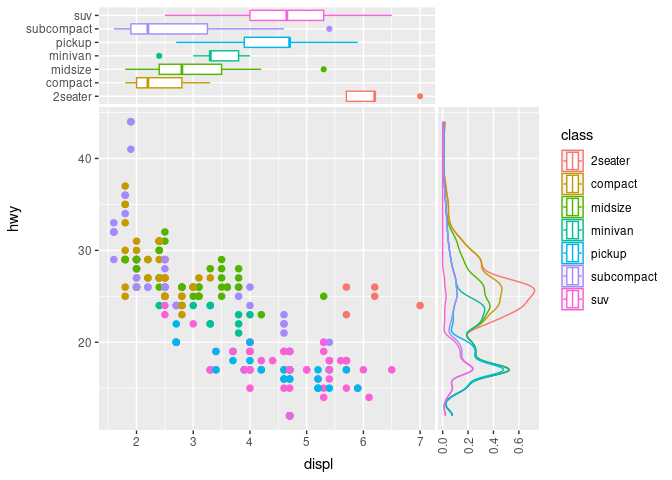
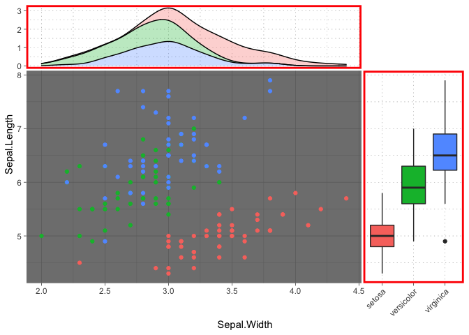

README
================
Justin Landis
12/11/2021

# ggside 

<!-- badges: start -->

[](https://travis-ci.org/jtlandis/ggside)
[](https://cran.r-project.org/package=ggside)
[](https://cran.r-project.org/package=ggside)
[](https://cran.r-project.org/package=ggside)
[](https://github.com/jtlandis/ggside/actions)
<!-- badges: end -->

## Overview

The R package ggside expands on the ggplot2 package. This package allows
the user to add graphical information about one of the main panel’s
axis. This is particularly useful for metadata for discrete axis, or
summary graphics on a continuous axis such as a boxplot or a density
distribution.

## Installation

Please install from CRAN for the latest stable version of `ggside`. You
can also install from the Github as seen below.

``` r
#CRAN
utils::install.packages("ggside")
#Github
devtools::install_github("jtlandis/ggside")
```

## Usage

Using this package is similar to adding any additional layer to a
ggplot. All geometries supported by ggside follow a pattern like
`geom_xside*` or `geom_yside*` which will add that geometry to either
the x side panel or the y side panel respectively. If you add
`geom_xsidedensity` to a plot, then this places a density geometry in
its own panel that is positioned by default above the main panel. This
panel will share the same x axis of the main panel but will have an
independent y axis. Take the following example from the ggplot2 readme.

``` r
library(ggplot2)
library(ggside)
#> Registered S3 method overwritten by 'ggside':
#>   method from   
#>   +.gg   ggplot2

ggplot(mpg, aes(displ, hwy, colour = class)) + 
  geom_point(size = 2) +
  geom_xsidedensity(aes(y = after_stat(density)), position = "stack") +
  geom_ysidedensity(aes(x = after_stat(density)), position = "stack") +
  theme(axis.text.x = element_text(angle = 90, vjust = .5))
```

<!-- -->

Mix discrete and continuous axis with `scale_xsidey_*`/`scale_ysidex_*`.

``` r
ggplot(mpg, aes(displ, hwy, colour = class)) + 
  geom_point(size = 2) +
  geom_xsideboxplot(aes(y =class), orientation = "y") +
  scale_xsidey_discrete() + #In order to use xsideboxplot with a main panel that uses
  #continuous data, force y axis in xside panel to be discrete
  geom_ysidedensity(aes(x = after_stat(density)), position = "stack") +
  scale_ysidex_continuous(guide = guide_axis(angle = 90), minor_breaks = NULL) +
  theme(ggside.panel.scale = .3)
```

<!-- -->

With version 0.2.0, more theme elements allow for better control over
how side panels are rendered.

``` r
ggplot(iris, aes(Sepal.Width, Sepal.Length, fill = Species)) +
  geom_point(aes(color = Species)) +
  geom_xsidedensity(alpha = .3, position = "stack") +
  geom_ysideboxplot(aes(x = Species), orientation = "x") +
  scale_ysidex_discrete(guide = guide_axis(angle = 45)) +
  theme_dark() +
  theme(ggside.panel.scale = .3,
        ggside.panel.border = element_rect(NA, "red", size = 2),
        ggside.panel.grid = element_line("black", size = .1, linetype = "dotted"),
        ggside.panel.background = element_blank()) +
  guides(color = "none", fill = "none")
```

<!-- -->

For a more detailed guide please see `vignette('ggside_basic_usage')`
for more information.

## Issues and Bug Reporting

If you find any issues or want to suggest an enhancement, please make a
post at [jtlandis/ggside](https://github.com/jtlandis/ggside/issues).

## Known Issues

The following section will summarize issues that are present on the
current CRAN release. These will either be fixed on the main branch of
this git repository, or currently in development to be fixed on one of
the development branches. The current CRAN version of `ggside` is
v0.2.0.

-   [\#3
    ](https://github.com/jtlandis/ggside/issues/3)
    Bug involving `geom_abline()`, `geom_hline()` or `geom_vline()` in
    combination with a `facet_(wrap|grid)` and any `ggside` geometry.
    Solution is TBD.

-   [\#28
    ](https://github.com/jtlandis/ggside/issues/3)
    Bug when a new data frame is passed to a `ggside` geometry layer and
    makes use of the `(x|y)color` or `(x|y)fill` aesthetic while a
    `color` or `fill` aesthetic is specified globally. If the new data
    frame does not contain a column with the name of the global
    aesthetic, then it throws an error. Solution is TBD.
