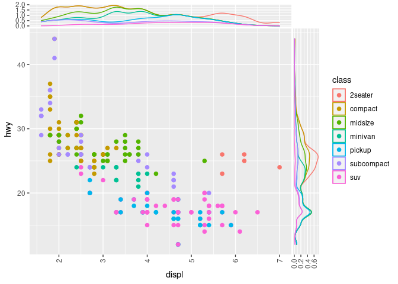
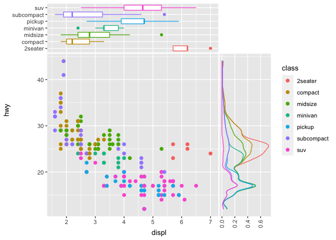

README
================
Justin Landis
2/22/2021

# ggside 

<!-- badges: start -->

[](https://travis-ci.org/jtlandis/ggside)
[](https://cran.r-project.org/package=ggside)
[](https://cran.r-project.org/package=ggside)
<!-- badges: end -->

## Overview

The R package ggside expands on the ggplot2 package. This package allows
the user to add graphical information about one of the main panel’s
axis. This is particularly useful for metadata for discrete axis, or
summary graphics on a continuous axis such as a boxplot or a density
distribution.

## Installation

Please install from CRAN for the latest stable version of `ggside`. You
can also install from the Github as seen below.

``` r
#CRAN
utils::install.packages("ggside")
#Github
devtools::install_github("jtlandis/ggside")
```

## Usage

Using this package is similar to adding any additional layer to a
ggplot. All geometries supported by ggside follow a pattern like
`geom_xside*` or `geom_yside*` which will add that geometry to either
the x side panel or the y side panel respectively. If you add
`geom_xsidedensity` to a plot, then this places a density geometry in
its own panel that is positioned by default above the main panel. This
panel will share the same x axis of the main panel but will have an
independent y axis. Take the following example from the ggplot2 readme.

``` r
library(ggplot2)
library(ggside)
#> Registered S3 method overwritten by 'ggside':
#>   method from   
#>   +.gg   ggplot2

ggplot(mpg, aes(displ, hwy, colour = class)) + 
  geom_point(size = 2) +
  geom_xsidedensity(aes(y = after_stat(density)), position = "stack") +
  geom_ysidedensity(aes(x = after_stat(density)), position = "stack") +
  theme(axis.text.x = element_text(angle = 90, vjust = .5))
```

<!-- -->

Mix discrete and continuous axis with `scale_xsidey_*`/`scale_ysidex_*`.

``` r
ggplot(mpg, aes(displ, hwy, colour = class)) + 
  geom_point(size = 2) +
  geom_xsideboxplot(aes(y =class), orientation = "y") +
  scale_xsidey_discrete() + #In order to use xsideboxplot with a main panel that uses
  #continuous data, force y axis in xside panel to be discrete
  geom_ysidedensity(aes(x = after_stat(density)), position = "stack") +
  scale_ysidex_continuous(guide = guide_axis(angle = 90), minor_breaks = NULL) +
  theme(ggside.panel.scale = .3)
```

<!-- -->

For a more detailed guide please see `vignette('ggside_basic_usage')`
for more information.

## Issues and Bug Reporting

If you find any issues or want to suggest an enhancement, please make a
post at [jtlandis/ggside](https://github.com/jtlandis/ggside/issues).
